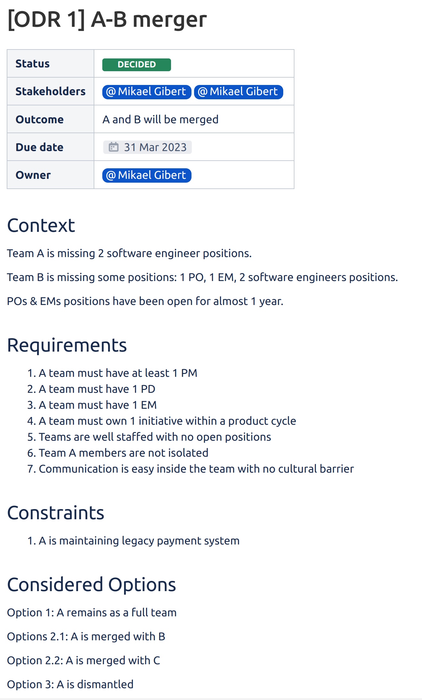
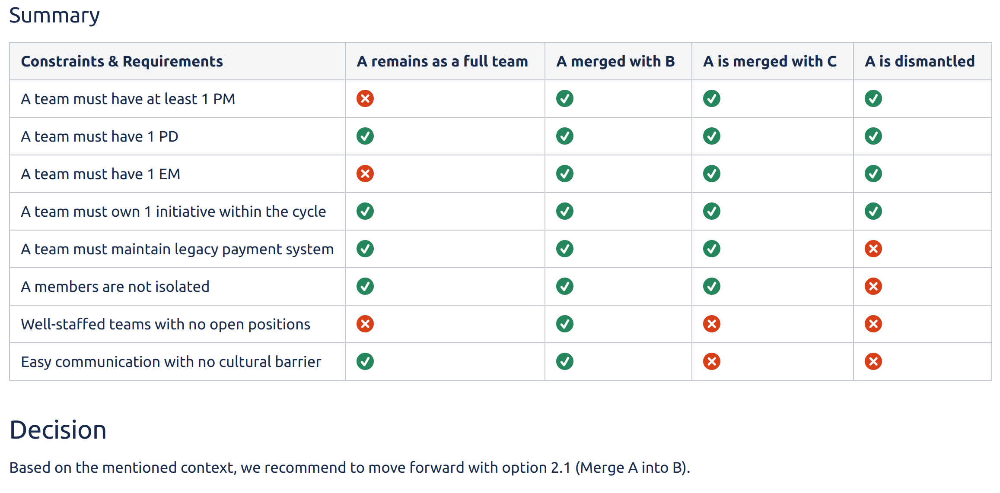

+++
title = 'ODR: Decision-making made simple'
description = 'Discover how the Organization Decision Record (ODR) framework simplifies complex decision-making by structuring context, constraints, and options. Learn a practical approach to documenting and streamlining organizational decisions effectively.'
date = 2023-03-28
draft = false
categories = ['theory of constraints', 'management']
tags = ['decision-making']
+++

## Introduction

As a manager, it is often really hard to make your process for making decisions crystal clear. As well as making these decisions understood, collaborative, and integrated.

How often do you hear or pronounce sentences: "That decision makes no sense", "This decision is unrealistic", "I think you've missed the point" or "Isn't this a better solution"?

An obscure decision-making process can only lead to confusion.

Well, you are in the right place, let me introduce you to the ODR: Organization Decision Record.

You may have heard about the ADRs: Architecture Decision Records, a popular tool for capturing Architectural Decisions and their context. It has many positive side-effects: documentation, clarification, explanation...

The ODRs are directly inspired by the ADR and Software Testing approaches.

## Sounds great, how do you start?

Let's be clear: no manager makes a decision for pleasure, we have to make decisions based on context, constraints, and/or requirements. The first step is to collect all of them!

At this point, we are not even considering options, finding solutions, or reducing the scope of the problem. We are creating the scoring matrix for future situations that might present themselves.

Some definitions and examples will help to understand the nature of this trio!

### Context

This makes up the undeniable facts.

For instance:

- X Key People left the company.
- The Senior Incredible Partner position has not been filled for Y months.
- Project CrazyShark has been stuck for Z months.
- Company A is merging with Company B.

### Constraints

These define things that must be achieved, whether we like it or not.

For instance:

- System Pieceofshut needs to be maintained as it is the only available payment system.
- A law prevents the company to hire people outside their operating footprint.
- Security prevents external collaborators from bringing their own devices.

### Requirements

This defines the ideal target state we want to reach. It is usually the main reason why we open a new Decision Record.

For instance:

- Release a new product for YYYY/MM/DD.
- Teams from each company should be mixed.
- Engineering Manager John Doe has only 1 team to manage.
- Each team needs a Product Owner.

Elements from these 3 categories make the decision drivers explicit, and they are used to score the considered options afterward.

## Considered options

Once the context, constraints, and requirements are exhaustively listed you can open the document to everyone in the company!

That will provide transparency, open the door for feedback, and let anyone interested contribute to the decision. This'll explicitly say that the organization needs to make a decision and these are the factors that will drive the adopted solution.

Now, you can start to list the options. At this point, we don't want to reduce the scope or possibilities, we still want to be as exhaustive as we can.

A mock example to help paint a picture:

> Team A does not have a PO anymore:
>
> - Option 1: Fire the whole team
>
> - Option 2: Hire an external PO
>
>   - Option 2.1: Open a backfill position
>   - Option 2.2: Hire a contractor
>
> - Option 3: Transfer an internal PO
>
>   - Option 3.1: Transfer John Doe from Team A
>   - Option 3.2: Transfer Jane Doe from Team B

As you can see, you'll consider all the available options, even the most extreme ones.

This process is open, and anyone in the company should be able to contribute, as it would prevent us from missing some options.

## Decision drivers, considered option, now what?

Now it's time for scoring!

This is quite an easy step, as it's all about creating a table to include:

- One column for each considered option.
- One line for each constraint.
- One line for each requirement.
- Then each cell is checked or not.

When the case is fairly simple, the table is enough to elect an option as THE SOLUTION (which will be loved or hated). The most important action is to provide clarity and comprehensive reading on the decision.

More complex cases could lead to adding constraints and requirements or weighting them.

## Full Example

## Conclusion

In summary, I love this decision-making framework as it really reminds me of the software testing mindset: defining first why you do things and what are the success criteria.

All the different options are then considered (even the terrible and extreme ones) to finally decide, by scoring the options using the success criteria.

It could be used for making any decision... so maybe ADR: Any Decision Record would be a better name :)