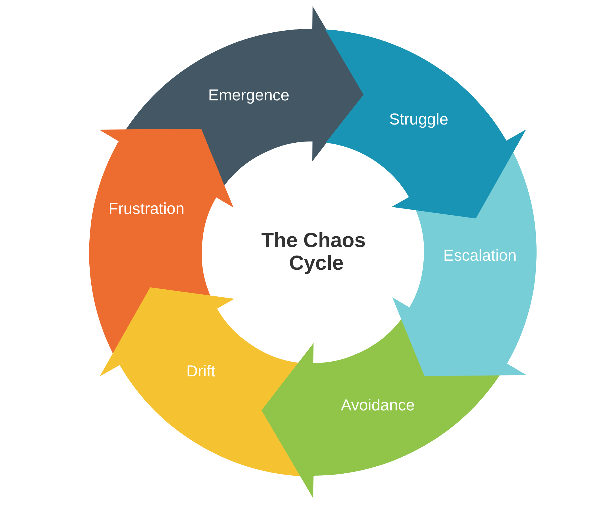
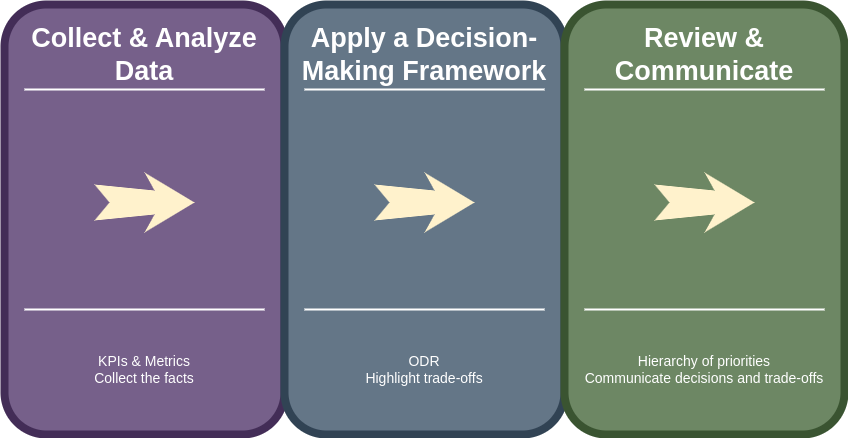

+++
title = 'Aligning Priorities Across Teams in a Large, Distributed Company'
description = 'Learn how to align priorities across teams in a large, distributed company using structured decision-making frameworks. Discover how to identify and resolve conflicting priorities, make explicit trade-offs, and ensure conscious, data-driven decisions. Improve cross-team collaboration, prevent accidental prioritization, and create a clear roadmap for success.'
date = 2025-03-14
draft = false
categories = ['management']
tags = ['decision making', 'leadership']
+++

## Introduction

In a large, distributed company, aligning teams is challenging. With different objectives, inefficiencies and conflicts can arise. OKRs (Objectives and Key Results), KPIs (Key Performance Indicators), and metrics help guide decisions, but they can also create competition, leading to **unintended prioritization due to lack of alignment**.

These conflicts can lead to disengagement, frustration, and inefficiencies without a structured decision-making framework.

- **OKRs** define ambitious goals with measurable outcomes, ensuring alignment on high-level objectives.
- **KPIs** track ongoing performance in key areas, providing insight into operational success.
- **Metrics** offer data-driven insights but can lead to siloed thinking if not appropriately contextualized.

Used effectively, these tools create clarity and drive better decisions. However, when misaligned, they can generate conflicting priorities, leading to a cycle of **accidental decision-making**: the **Chaos Cycle** composed of 6 stages:

- **Emergence**: Competing priorities arise
- **Struggle**: Teams face difficulty resolving conflicts
- **Escalation**: Teams escalate to their management to find a resolution
- **Avoidance**: Decision-makers evade tough trade-offs
- **Drift**: Strategic intent becomes unclear
- **Frustration**: Teams feel disillusioned

### Common Priority Conflicts

Teams often optimize for their own KPIs, sometimes at the expense of company-wide goals. Some classics include:

| Conflict | Description | Consequence |
|----------|-------------|-------------|
| Sales vs. Product | Sales pushes for fast releases to close deals, while Product slows down to ensure quality | Customer churn due to bugs or unmet expectations |
| Engineering vs. Marketing | Engineers focus on reducing technical debt, while Marketing demands rapid feature rollouts | Fragile systems and potential outages |
| Regional vs. Global Teams | Local teams prioritize market-specific needs, while headquarters pushes for standardization | Resistance, inefficiencies, or market misalignment |
| Customer Support vs. Product Development | Support wants to minimize response times, while new product features increase customer inquiries | Short-term bottlenecks in support |
| Legal & Compliance vs. Business Development | Compliance enforces strict regulations, potentially delaying product launches, while business teams push for speed-to-market | Missed competitive opportunities or compliance risks |

Without clear alignment, decisions default to the loudest voice rather than strategic intent. Avoiding tough decisions leads to **unintended prioritization**, where trade-offs are neither understood nor managed. The consequence is **team disengagement and wasted effort**.

### Resolving Conflicts

Clarity on priorities and explicit trade-offs foster **psychological safety**, ensuring teams trust the process and collaborate effectively. Shared metrics and data-driven decisions reduce ambiguity and create alignment.

#### 1. Collect and Analyze Data
   - Use KPIs, OKRs, and performance metrics to understand interactions between priorities.
   - Ensure visibility into team-level goals and company-wide objectives, making contributions to the value chains explicit and monitorable.

#### 2. Apply a Decision-Making Framework
   - Use an [**Organizational Decision Record (ODR)**](https://migibert.github.io/posts/odr-intro/) to document key decisions transparently.
   - Define a clear conflict-resolution process when priorities clash.
   - Make trade-offs explicit to prevent **unintended prioritization**.

#### 3. Regularly Review and Communicate Priorities
   - Establish a clear hierarchy of priorities.
   - Hold routine alignment meetings to reassess and adjust as needed.
   - Transparently communicate decisions and trade-offs, highlighting the reasoning behind each decision.
   - Reinforce **intentional, conscious decision-making** to avoid reactive prioritization.
   - Recognizing and explaining decisions openly increases **team confidence and engagement**, strengthening trust in leadership and the decision-making process.

### Conclusion

Aligning priorities in a large company requires clear communication and intentional decisions. While OKRs, KPIs, and metrics are essential, they can lead to misalignment if used in isolation. By leveraging structured decision-making frameworks and regularly reviewing priorities, companies can make deliberate, strategic choices rather than reactive ones.

The **Organizational Decision Record (ODR)** plays a crucial role in ensuring key decisions are documented, tracked, and refined over time. The goal isn’t to eliminate competing priorities but to **consciously manage them**, ensuring the company moves forward as a whole. Conscious decision-making not only resolves conflicts effectively but also builds a culture of trust and engagement, where teams feel empowered and aligned with leadership.

